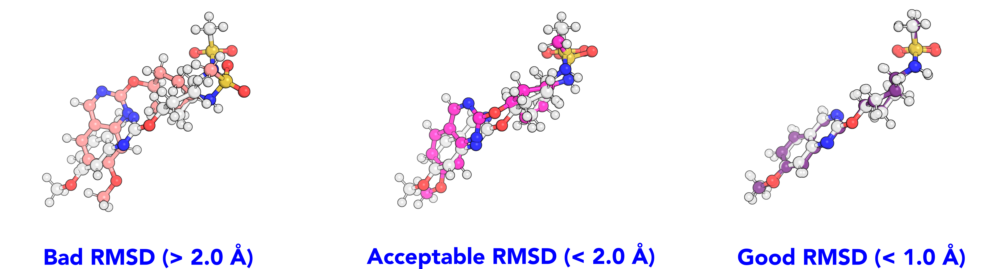

.. _small_molecule_minimization:

Small molecule minimization
===========================

Purpose
-------

This benchmark assesses the **MLIP**'s capability to preserve the ground-state geometry of organic small molecules during
energy minimization, ensuring that initial **X-ray** or **DFT**-optimized structures remain accurate and physically consistent.

Description
-----------

This benchmark performs energy minimization using the
`fire_descent <https://jax-md.readthedocs.io/en/main/jax_md.minimize.html#jax_md.minimize.fire_descent>`_
algorithm from `jax-md <https://github.com/google/jax-md>`_, as integrated via the
`mlip <https://github.com/instadeepai/mlip>`_ library.

The systems are minimized over **1,000 steps** using the **FIRE** (Fast Inertial Relaxation Engine)
algorithm with default parameters to control the adaptive velocity-based optimization,
balancing fast convergence with numerical stability.

After minimization, structural fidelity is assessed by computing the
**root-mean-square deviation (RMSD)** of all heavy atoms relative to the initial geometry,
using the **RMSD** implementation provided by `mdtraj <https://www.mdtraj.org/>`_.

    Classification of energy minimization results based on RMSD values.

Dataset
-------

This benchmark draws its test set from the **OpenFF** \ [#f1]_ industry dataset, which contains 73301 conformers of thousands of different molecules, collected by industry
partners of the **OpenFF consortium**. To keep the benchmark conductable in a reasonable amount of time on standard hardware,
we extracted 100 geometries of neutral molecules and 10 structures of charged molecules from the dataset.
We ensured chemical diversity in this reduced dataset by applying the rdkit `MaxMinPicker <http://rdkit.org/docs/cppapi/classRDPickers_1_1MaxMinPicker.html>`_
to the Morgan fingerprints of the original datasets.

Interpretation
--------------

The energy minimization benchmark can be understood as a sanity-check benchmark to verify that the **MLIP** recognizes a true geometrical
minimum of a molecule as such. Often, true ground state structures, with forces on all atoms being essentially zero, are absent from training data.
In this case the ability of the **MLIP** to correctly interpolate between near-minimum structures is tested. In any case, the ground-truth geometry
should be retained and not deviate from the **QM** geometry. Since the **QM** geometry is also the starting structure, the geometry should ideally
not be changed at all. We apply a strict 0.3 Å criterion for a good **RMSD** here, to reflect this demand.

References
----------

.. [#f1] Reference for OpenFF industry dataset:  L. D'Amore, [...], Gary Tresadern, J. Chem. Inf. Model. 2022. DOI:https://doi.org/10.1021/acs.jcim.2c01185
